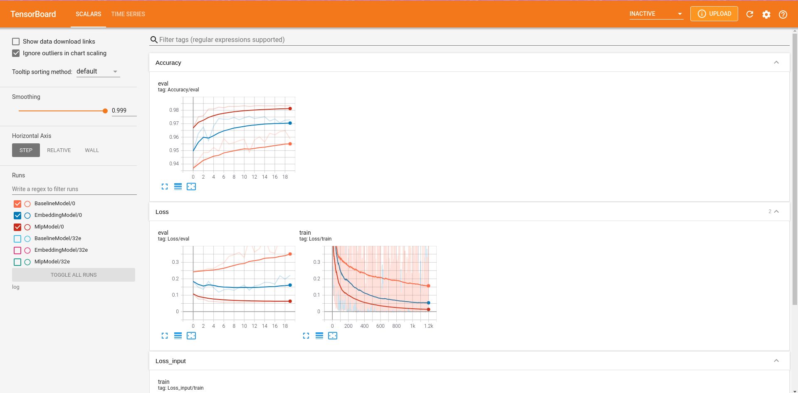
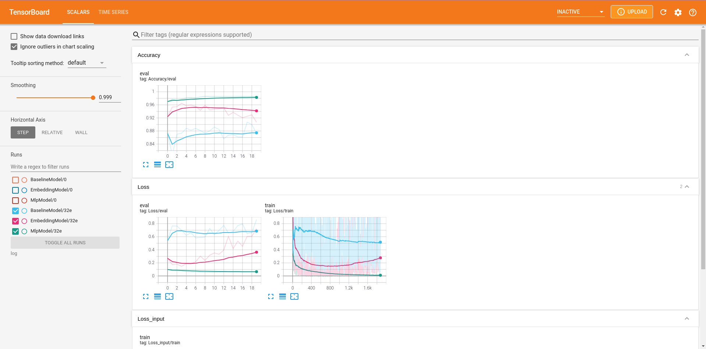
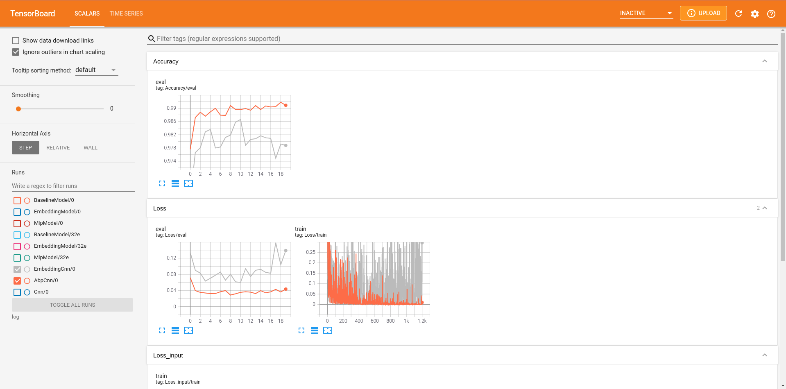

# Another Back Propagation

This is a repository illustrating the another back propagation about its utility, reproducibility and superiority.

## 0. Reproduce the experiment results
Just run the following commands respectively.

### 0.0. MLP for MNIST
```
python train.py --log 0 --model BaselineModel
python train.py --log 0 --model EmbeddingModel
python train.py --log 0 --model MlpModel --weight 0.4
```

### 0.1. ConvNet for MNIST
```
python train.py --log 0 --lr 0.05 --train_batch_size 64 --eval_batch_size 128 --model Cnn
python train.py --log 0 --lr 0.05 --train_batch_size 64 --eval_batch_size 128 --model EmbeddingCnn
python train.py --log 0 --lr 0.05 --train_batch_size 64 --eval_batch_size 128 --model AbpCnn --weight 0.2
```

Train them again on 50 epochs, only abp with w less than 0.8 would converge:
```
python train.py --log epoch=50 --lr 0.05 --train_batch_size 64 --eval_batch_size 128 --epoch 50 --model Cnn
python train.py --log epoch=50 --lr 0.05 --train_batch_size 64 --eval_batch_size 128 --epoch 50 --model EmbeddingCnn
python train.py --log epoch=50,w=0.9 --lr 0.05 --train_batch_size 64 --eval_batch_size 128 --epoch 50 --model AbpCnn --weight 0.9
python train.py --log epoch=50,w=0.8 --lr 0.05 --train_batch_size 64 --eval_batch_size 128 --epoch 50 --model AbpCnn --weight 0.8
```

### 0.2. VGG for Cifar-10
```
python train.py --log use_wd --train_batch_size 128 --eval_batch_size 256 --lr 0.05 --epoch 100 --model Vgg16 --use_wd
python train.py --log use_wd --train_batch_size 128 --eval_batch_size 256 --lr 0.05 --epoch 100 --model EmbeddingVgg16 --use_wd
python train.py --log no_wd  --train_batch_size 128 --eval_batch_size 256 --lr 0.05 --epoch 100 --model AbpVgg16 --weight 0.1
```

To prove Vgg16 and EmbeddingVgg16 wouldn’t converge without the weight decay, and the weight decay is harmful to ABP:
```
python train.py --log no_wd  --train_batch_size 128 --eval_batch_size 256 --lr 0.05 --epoch 100 --model Vgg16
python train.py --log no_wd  --train_batch_size 128 --eval_batch_size 256 --lr 0.05 --epoch 100 --model EmbeddingVgg16
python train.py --log use_wd --train_batch_size 128 --eval_batch_size 256 --lr 0.05 --epoch 100 --model AbpVgg16 --use_wd --weight 0.1
```

### 0.3. More beyond papers
These 3 commands show the robust of our ABP:
```
python train.py --log lr=0.09 --lr 0.09 --train_batch_size 64 --eval_batch_size 128 --model Cnn
python train.py --log lr=0.09 --lr 0.09 --train_batch_size 64 --eval_batch_size 128 --model EmbeddingCnn
python train.py --log lr=0.09 --lr 0.09 --train_batch_size 64 --eval_batch_size 128 --model AbpCnn --weight 0.2
```

### 0.4. Visualize Results
refer to [results visualization](#Results)

## 1. Train model
   ```
   python train.py --model [str] --log [str] --lr [float] --momentum [float] --weight [float] --epoch [int] --train_batch_size [int] --eval_batch_size [int] [--use_wd]
   ```

   There are 3 types of comparable model, {BaselineModel, EmbeddingModel, MlpModel}, {Cnn, EmbeddingCnn, AbpCnn} and {Vgg16, Vgg16_bn, EmbeddingVgg16, EmbeddingVgg16_bn, AbpVgg16, AbpVgg16bn}. {*Model} and {*Cnn} is trained on MNIST, and {*VGG} on CIFAR-10.

1. train BaselineModel
    ```
    python train.py --model BaselineModel --log $number
    ```
2. train EmbeddingModel
    ```
    python train.py --model EmbeddingModel --log $number
    ```
3. train MlpModel
    ```
    python train.py --model MlpModel --log $number --weight 0.4
    ```
4. train Cnn
   ```
   python train.py --model Cnn --log $number --lr 0.05 --train_batch_size 64 --eval_batch_size 128
   ```
5. train  EmbeddingCnn
   ```
   python train.py --model EmbeddingCnn --log $number --lr 0.05 --train_batch_size 64 --eval_batch_size 128
   ```
6. train AbpCnn
   ```
   python train.py --model AbpCnn --log $number --lr 0.05 --weight 0.2 --train_batch_size 64 --eval_batch_size 128
   ```
7. train Vgg16
   ```
   python train.py --model Vgg16 --log $number --train_batch_size 128 --eval_batch_size 256 --lr 0.05 --epoch 100 --use_wd
   ```
8. train EmbeddingVgg16
   ```
   python train.py --model EmbeddingVgg16 --log $number --train_batch_size 128 --eval_batch_size 256 --lr 0.05 --epoch 100 --use_wd
   ```
9. train AbpVgg16
   ```
   python train.py --model AbpVgg16 --log $number --train_batch_size 128 --eval_batch_size 256 --weight 0.1 --lr 0.05 --epoch 100
   ```

Adjust epoch, learning rate, momentum, batch size as you like.

## 2. Requirements
pytorch >= 1.0

tensorboard

## <span id="Results">3. Results Visualization</span>

training log organizes as the following form

```
├── log
│   ├── modelA  ├── number0  ├── run0.log
│   │                     
│   │           ├── number1  ├── run1.log
│   │          
│   │           ├── number2  ├── run2.log
│           
│   ├── modelB  ├── number0  ├── run0.log
│   │                      
│   │           ├── number1  ├── run1.log
│   │           
│   │           ├── number2  ├── run2.log
│         
│   ├── modelC  ├── number0  ├── run0.log
│   │                     
│   │           ├── number1  ├── run1.log
│   │           
│   │           ├── number2  ├── run2.log
│         
......
```

running
    ```
    tensorboard --logdir=log
    ```

you could get this:

   

These 3 models above possesses the same network architecture, especially MlpModel amd BaselineModel is equivalent in parameter numbers. The smaller the training batch size is, the superiority of MlpModel is more apparent. However, when decreasing learning rate, their accuracy gap would decline, abp still performs not worse than others.

when set training batch size to 32, we would observe the following phenomenon:

   

Image below doesn't show Cnn training curve, because it converges badly on the same settings(lr=0.09, train_batch_size=64), just try it yourself!

   

ABP is obviously Robust！！！
